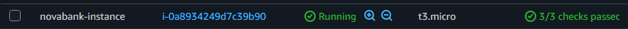
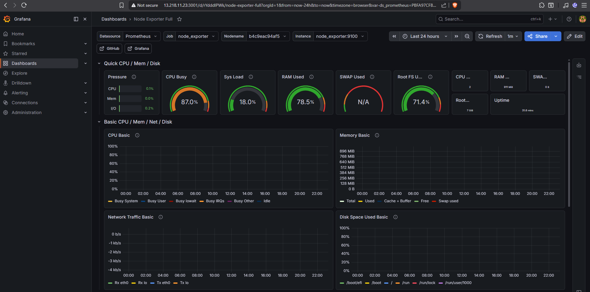
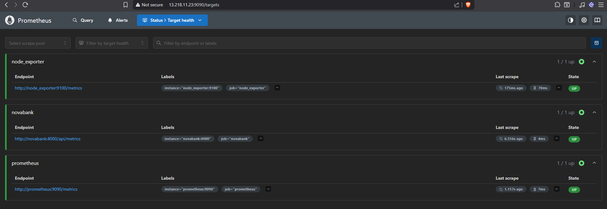
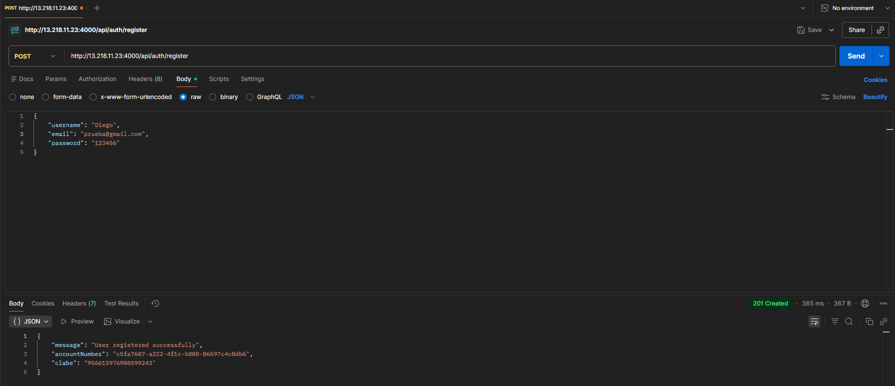
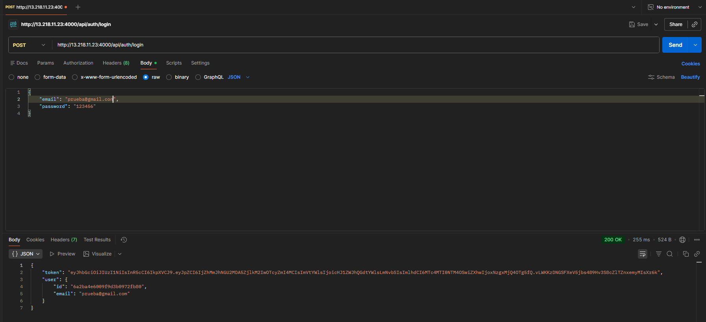
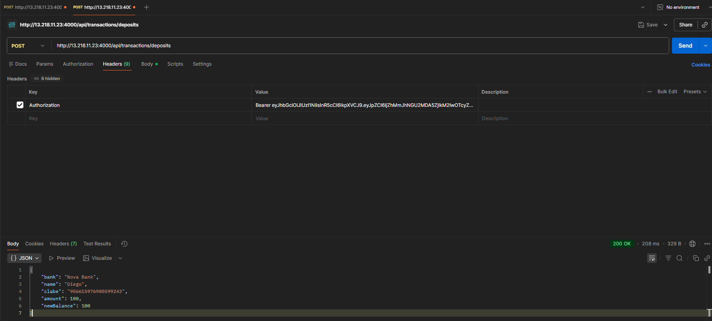
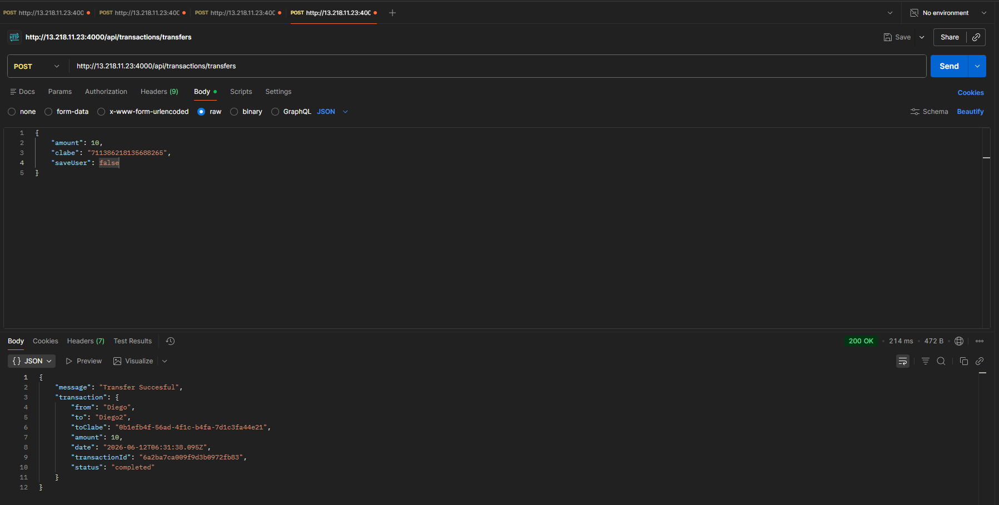
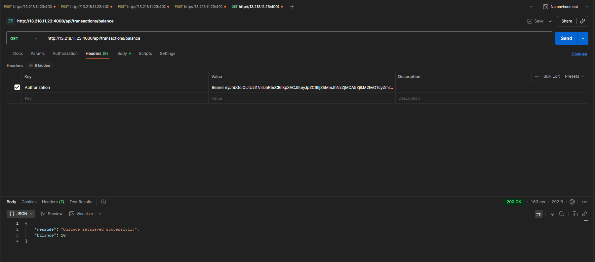
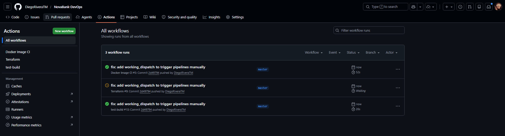

# NovaBankAPI


This is my second DevOps project, building on top of what I learned in MetricsWatch. NovaBankAPI is a banking backend focused on cloud infrastructure, observability, and CI/CD automation.

---

## Background

NovaBank started as a fullstack banking application I built last year using the MERN stack and AWS. For this DevOps iteration, I kept the backend business logic and redesigned the project around infrastructure, monitoring, and automation.

---

## What is NovaBankAPI?

A banking backend API that allows users to register, authenticate, and perform simulated banking operations such as deposits and transfers between accounts.

All endpoints are protected with JWT authentication middleware. The API can be tested using Postman or Bruno.

---

## API Endpoints

| Method | Endpoint | Description | Auth Required |
|--------|----------|-------------|---------------|
| POST | `/api/auth/register` | Register a new user | No |
| POST | `/api/auth/login` | Login and receive JWT token | No |
| GET | `/api/users/me` | Get user profile | Yes |
| POST | `/api/transactions/deposits` | Deposit funds | Yes |
| POST | `/api/transactions/transfers` | Transfer funds via CLABE | Yes |
| GET | `/api/transactions` | Get transaction history | Yes |
| GET | `/api/transactions/balance` | Get current balance | Yes |
| GET | `/api/metrics` | Prometheus metrics endpoint | No |

---

## Security Considerations
- SSH access is currently open to all IPs. In production, restrict port 22 to specific IP ranges.
- Prometheus and Node Exporter ports should be restricted to internal access only in a production environment.
- If you're thinking to use or adapt this project, consider to change the VPC ip's that are on the ingress/egress in order to avoid security problems
---

## DevOps Stack

| Tool | Purpose |
|------|---------|
| Express | Backend framework |
| Docker | Containerize all services |
| Terraform | Provision AWS infrastructure (EC2, VPC) |
| Prometheus | Scrape and store API metrics |
| Grafana | Visualize real-time dashboards |
| GitHub Actions | CI/CD pipeline |
| AWS EC2 | Host the application in the cloud |
| MongoDB Atlas | Cloud database |

---

## Getting Started

Clone the repository and run the following command from the root of the project:

```bash
docker-compose up --build
```

Once running, open your browser and go to:

- API: `http://localhost:4000`
- Metrics: `http://localhost:4000/api/metrics`
- Prometheus: `http://localhost:9090`
- Grafana: `http://localhost:3001`

---

## CI/CD Pipeline

Every push to `main` triggers a GitHub Actions workflow that:

1. Installs dependencies
2. Runs tests
3. Builds the Docker image
4. Deploys to AWS EC2

---

## AWS Deployment

The project is deployed on AWS EC2 (t3.micro) provisioned with Terraform.



### Grafana Dashboard


### Prometheus Targets


### API Tests on AWS

#### Register


#### Login


#### Deposit


#### Transfer


#### Balance


## Github Actions CI/CD

This project has a CI/CD pipeline using three workflow files (ci-cd, docker, and terraform) in order to test and create a complete environment to run the project, using the correct credentials and configurations.



> **Note:** AWS deployment URLs may change as the EC2 instance is restarted. The project can be run locally using `docker-compose up --build`.